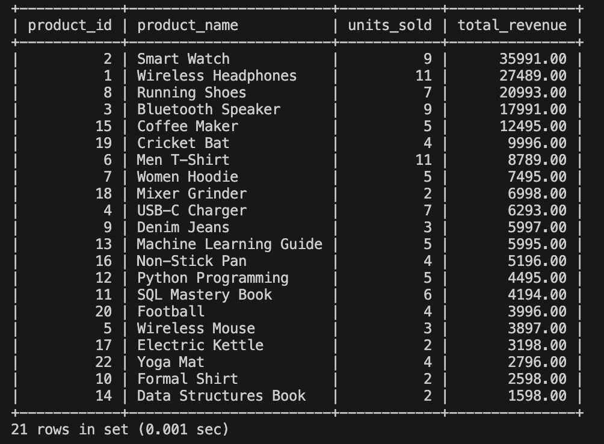
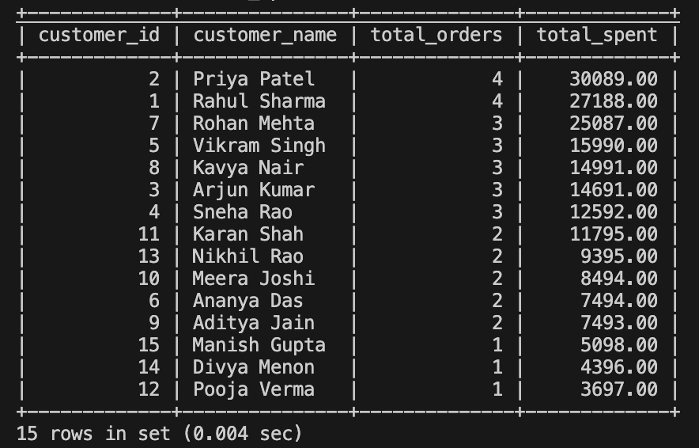
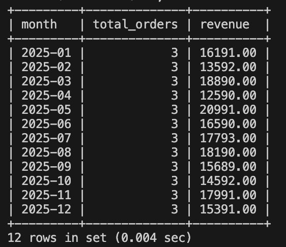
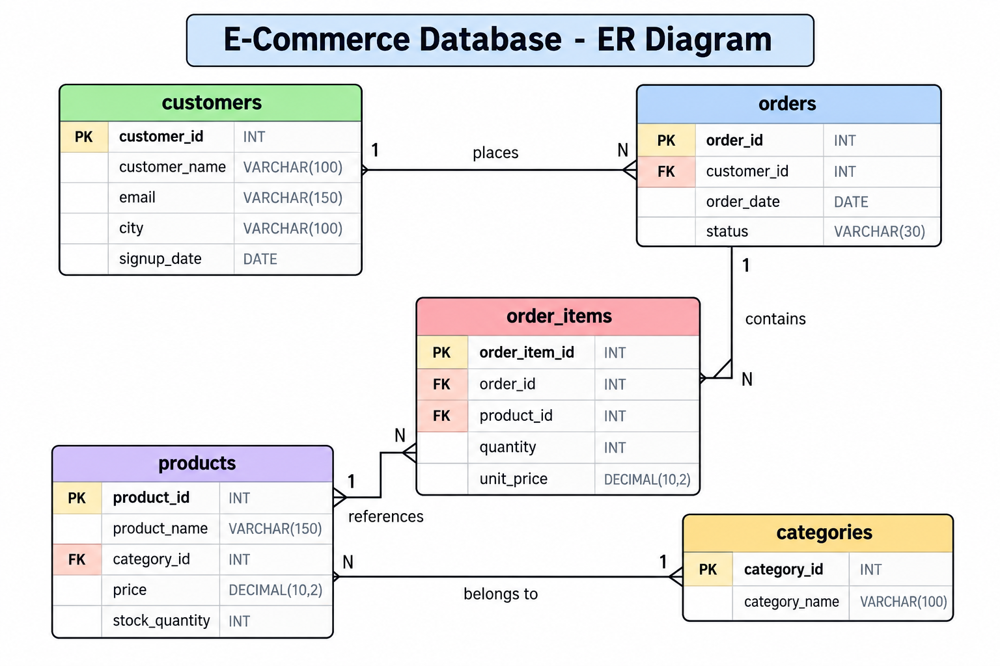

# 🛒 E-Commerce Database Analysis

A SQL-based e-commerce analytics project built with MySQL.
The project analyzes product performance, customer spending,
order trends, category revenue, and inventory.

## 🚀 Quick Start

### MySQL

Run the files in this order:

mysql -u root -p < schema.sql

mysql -u root -p ecommerce_db < data.sql

mysql -u root -p ecommerce_db < queries.sql

Or open the files in MySQL Workbench and execute them in order.

---

## 🗄️ Database

customers ──< orders ──< order_items >── products >── categories

| Table | Key Columns | Purpose |
|---|---|---|
| `customers` | customer_id, name, email, city | Customer information |
| `categories` | category_id, category_name | Product categories |
| `products` | product_id, name, category_id, price, stock | Product catalog |
| `orders` | order_id, customer_id, order_date, status | Customer orders |
| `order_items` | order_item_id, order_id, product_id, quantity | Products in each order |

---

## 📊 What's Covered

| Section | Analysis | SQL Skills |
|---|---|---|
| A | Product Analysis | JOIN, GROUP BY, SUM, ORDER BY |
| B | Top Products | LIMIT, aggregation, ranking |
| C | Customer Spend | JOIN, GROUP BY, HAVING |
| D | Order Trends | DATE_FORMAT, COUNT, SUM |
| E | Category Analysis | Multi-table JOINs |
| F | Advanced SQL | CTEs, RANK(), DENSE_RANK() |
| G | Inventory | LEFT JOIN, filtering |

---

## 🔥 Top Products

The project identifies:

- Top products by units sold
- Top products by revenue
- Top 5 products
- Best product in each category
- Products that have never been sold

### Result

---

## 💰 Customer Spending

Customer analysis identifies:

- Highest-spending customers
- Number of orders per customer
- Customer lifetime value
- Customer spending rankings
- Repeat customers

### Result

---

## 📈 Order Trends

Monthly analysis provides:

- Total orders
- Monthly revenue
- Highest-revenue month
- Order growth trends

### Result

---

## 📦 Category Performance

The database analyzes revenue and units sold across:

- Electronics
- Clothing
- Books
- Home & Kitchen
- Sports

---

## 🧠 SQL Concepts Demonstrated

- `SELECT`
- `WHERE`
- `JOIN`
- `LEFT JOIN`
- `GROUP BY`
- `HAVING`
- `ORDER BY`
- `LIMIT`
- `SUM()`
- `COUNT()`
- `AVG()`
- Subqueries
- Common Table Expressions
- Window Functions
- `RANK()`
- `DENSE_RANK()`
- Date Functions

---

## 📁 Project Structure

ecommerce-db/
│
├── schema.sql
├── data.sql
├── queries.sql
├── README.md
├── ER_Diagram.png
│
└── results/
    ├── top_products.png
    ├── customer_spend.png
    └── order_trends.png

---

## 🖼️ ER Diagram

---

## 🎯 Project Objective

The objective of this project is to demonstrate how SQL and relational
databases can be used to analyze e-commerce transaction data and
generate meaningful business insights.

The analysis helps identify high-performing products, valuable
customers, revenue trends, category performance, and inventory risks.

---

## 👨‍💻 Author

**Rajanagouda**

E-Commerce Database Analysis  
MySQL | SQL | Data Analytics